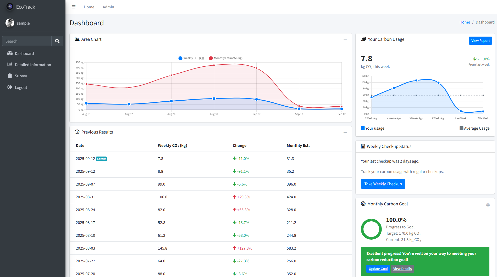

# EcoTrack
## 🍂 Track your enviromental impact




## Overview

EcoTrack helps you understand and reduce your impact on the environment. It shows you how your daily life affects your carbon footprint and helps you make better choices for the planet.

## Features

When you start using EcoTrack, you'll create an account and tell us a little bit about your lifestyle. The application will then:

- **Track your impact:** Answer a quick survey when you begin and short weekly check-ins to see how you're doing. We look at your home energy use, how you travel, what appliances you use, and how you handle waste.

- **Show your progress:** See your environmental impact through easy-to-read charts. Watch how your choices affect your carbon footprint over time and work toward your carbon goals.

- **Help you improve:** Get tips and suggestions based on your habits. As you make changes, EcoTrack learns what works for you and suggests new ways to reduce your impact.


## Getting started

> [!NOTE]
> We don't provide precompiled binaries - you're building this thing on your own.
>

First of all, clone the repo:

```
git clone https://github.com/AuburnMedia/ecotrack-adminlte
```
Build your virtual environment (or bring your own):
```
python -m venv .venv
source ./.venv/bin/activate
```

Now let's get it running:
```
python -m pip install -r requirements.txt

py manage.py collectstatic # Required 

py manage.py makemigrations
py manage.py migrate

py manage.py createsuperuser --username admin

py manage.py fill_sample_data admin # Optional: adds test data

py manage.py runserver
```

The site should be accessible at http://127.0.0.1:8000/.


## License

See LICENSE.md
